# Database Schema and ERD - PrintGrid Platform

## Overview
PrintGrid uses **PostgreSQL 14+** with **schema-per-module** organization within a single database.

**Database Name:** `printgrid_db`

---

## Entity Relationship Diagram

```mermaid
erDiagram
    %% Customer Schema
    Customer ||--o{ Order : places
    Customer ||--o{ Quote : receives
    Order ||--|| Quote : "derived from"
    Order ||--|{ OrderItem : contains
    OrderItem ||--|| Job : "becomes"
    
    %% Scheduling Schema
    Job }o--|| Machine : "assigned to"
    Job }o--|| Lab : "assigned to"
    Machine }o--|| Lab : "belongs to"
    Lab ||--o{ MaterialInventory : has
    Job ||--o{ Assignment : "has history"
    Job ||--o{ CalibrationData : "generates"
    
    %% Hub Schema
    Job ||--o{ InspectionResult : inspected
    InspectionResult ||--o| Job : "triggers reprint"
    Order ||--o{ Shipment : "fulfilled by"
    
    %% Shared Schema
    Lab ||--|| User : "managed by"
    Customer ||--|| User : "is a"
    
    %% Customer Schema Tables
    Customer {
        uuid id PK
        string email UK
        string password_hash
        string full_name
        timestamp created_at
        timestamp last_login_at
    }
    
    Quote {
        uuid id PK
        uuid customer_id FK
        string status
        decimal total_amount
        jsonb price_breakdown
        date delivery_date
        timestamp expires_at
        int parameter_version_id
        timestamp created_at
    }
    
    Order {
        uuid id PK
        uuid customer_id FK
        uuid quote_id FK
        string status
        decimal total_amount
        string currency
        date delivery_date
        string delivery_street
        string delivery_city
        string delivery_state
        string delivery_zipcode
        string delivery_country
        timestamp created_at
        timestamp updated_at
    }
    
    OrderItem {
        uuid id PK
        uuid order_id FK
        uuid model_id
        jsonb configuration
        int quantity
        decimal unit_price
        decimal total_price
    }
    
    %% Scheduling Schema Tables
    Lab {
        uuid id PK
        string name
        string location
        int transfer_time_minutes
        string status
        double performance_score
        timestamp created_at
        timestamp updated_at
    }
    
    Machine {
        uuid id PK
        uuid lab_id FK
        string name
        string brand
        string model
        string technology
        jsonb build_volume
        jsonb layer_height_range
        decimal achievable_tolerance_mm
        string status
        timestamp maintenance_until
        timestamp created_at
    }
    
    MaterialInventory {
        uuid id PK
        uuid lab_id FK
        string material
        string color
        decimal quantity_grams
        decimal reorder_point_grams
        decimal unit_cost
        timestamp last_restocked_at
    }
    
    Job {
        uuid id PK
        uuid order_item_id FK
        uuid machine_id FK
        uuid lab_id FK
        string status
        string priority
        uuid model_id
        jsonb configuration
        timestamp internal_due_date
        int estimated_duration_seconds
        int actual_duration_seconds
        decimal estimated_material_grams
        decimal actual_material_grams
        uuid original_job_id FK
        int reprint_count
        timestamp created_at
        timestamp assigned_at
        timestamp started_at
        timestamp completed_at
    }
    
    Assignment {
        uuid id PK
        uuid job_id FK
        uuid lab_id FK
        uuid machine_id FK
        jsonb candidate_scores
        string selected_reason
        timestamp assigned_at
    }
    
    CalibrationData {
        uuid id PK
        uuid job_id FK
        string machine_model
        string material
        int estimated_seconds
        int actual_seconds
        double ratio
        timestamp collected_at
    }
    
    %% Hub Schema Tables
    InspectionResult {
        uuid id PK
        uuid job_id FK
        uuid inspector_user_id FK
        string overall_result
        jsonb checklist_results
        jsonb photo_urls
        string defect_classification
        string fault_attribution
        string notes
        timestamp inspected_at
    }
    
    Shipment {
        uuid id PK
        uuid order_id FK
        string carrier
        string tracking_number
        decimal weight_kg
        timestamp shipped_at
        timestamp estimated_delivery
    }
    
    %% Shared Schema Tables
    User {
        uuid id PK
        string email UK
        string password_hash
        string full_name
        string role
        bool is_active
        timestamp created_at
        timestamp last_login_at
    }
    
    AuditLog {
        bigint id PK
        uuid user_id FK
        string event_type
        string entity_type
        uuid entity_id
        jsonb old_values
        jsonb new_values
        string ip_address
        timestamp created_at
    }
    
    Configuration {
        int id PK
        string category
        string key
        jsonb value
        int version
        uuid updated_by_user_id FK
        timestamp created_at
    }
```



---

## Schema Organization

```sql
-- Database: printgrid_db

-- Schemas
CREATE SCHEMA IF NOT EXISTS customer;
CREATE SCHEMA IF NOT EXISTS scheduling;
CREATE SCHEMA IF NOT EXISTS lab;
CREATE SCHEMA IF NOT EXISTS hub;
CREATE SCHEMA IF NOT EXISTS analytics;
CREATE SCHEMA IF NOT EXISTS shared;
```

---

## Detailed Table Definitions

### Customer Schema

```sql
-- customer.customers
CREATE TABLE customer.customers (
    id UUID PRIMARY KEY DEFAULT gen_random_uuid(),
    email VARCHAR(255) NOT NULL UNIQUE,
    password_hash VARCHAR(255) NOT NULL,
    full_name VARCHAR(255) NOT NULL,
    created_at TIMESTAMP NOT NULL DEFAULT NOW(),
    last_login_at TIMESTAMP NULL
);

CREATE INDEX idx_customers_email ON customer.customers(email);

-- customer.quotes
CREATE TABLE customer.quotes (
    id UUID PRIMARY KEY DEFAULT gen_random_uuid(),
    customer_id UUID NOT NULL REFERENCES customer.customers(id),
    status VARCHAR(50) NOT NULL DEFAULT 'VALID',
    total_amount DECIMAL(18,2) NOT NULL,
    currency VARCHAR(3) NOT NULL DEFAULT 'USD',
    price_breakdown JSONB NOT NULL,
    delivery_date DATE NOT NULL,
    expires_at TIMESTAMP NOT NULL,
    parameter_version_id INT NOT NULL,
    created_at TIMESTAMP NOT NULL DEFAULT NOW()
);

CREATE INDEX idx_quotes_customer_id ON customer.quotes(customer_id);
CREATE INDEX idx_quotes_status_expires ON customer.quotes(status, expires_at);

-- customer.orders
CREATE TABLE customer.orders (
    id UUID PRIMARY KEY DEFAULT gen_random_uuid(),
    customer_id UUID NOT NULL REFERENCES customer.customers(id),
    quote_id UUID NOT NULL REFERENCES customer.quotes(id),
    status VARCHAR(50) NOT NULL DEFAULT 'PAYMENT_PENDING',
    total_amount DECIMAL(18,2) NOT NULL,
    currency VARCHAR(3) NOT NULL DEFAULT 'USD',
    delivery_date DATE NOT NULL,
    delivery_street VARCHAR(255) NOT NULL,
    delivery_city VARCHAR(100) NOT NULL,
    delivery_state VARCHAR(100),
    delivery_zipcode VARCHAR(20) NOT NULL,
    delivery_country VARCHAR(100) NOT NULL,
    created_at TIMESTAMP NOT NULL DEFAULT NOW(),
    updated_at TIMESTAMP NOT NULL DEFAULT NOW()
);

CREATE INDEX idx_orders_customer_id ON customer.orders(customer_id);
CREATE INDEX idx_orders_status ON customer.orders(status);
CREATE INDEX idx_orders_created_at ON customer.orders(created_at DESC);

-- customer.order_items
CREATE TABLE customer.order_items (
    id UUID PRIMARY KEY DEFAULT gen_random_uuid(),
    order_id UUID NOT NULL REFERENCES customer.orders(id) ON DELETE CASCADE,
    model_id UUID NOT NULL,
    configuration JSONB NOT NULL,
    quantity INT NOT NULL DEFAULT 1,
    unit_price DECIMAL(18,2) NOT NULL,
    total_price DECIMAL(18,2) NOT NULL
);

CREATE INDEX idx_order_items_order_id ON customer.order_items(order_id);
```

---

### Scheduling Schema

```sql
-- scheduling.labs
CREATE TABLE scheduling.labs (
    id UUID PRIMARY KEY DEFAULT gen_random_uuid(),
    name VARCHAR(255) NOT NULL,
    location VARCHAR(255) NOT NULL,
    transfer_time_minutes INT NOT NULL,
    status VARCHAR(50) NOT NULL DEFAULT 'ACTIVE',
    performance_score DOUBLE PRECISION NOT NULL DEFAULT 0.70,
    created_at TIMESTAMP NOT NULL DEFAULT NOW(),
    updated_at TIMESTAMP NOT NULL DEFAULT NOW()
);

CREATE INDEX idx_labs_status ON scheduling.labs(status);

-- scheduling.machines
CREATE TABLE scheduling.machines (
    id UUID PRIMARY KEY DEFAULT gen_random_uuid(),
    lab_id UUID NOT NULL REFERENCES scheduling.labs(id),
    name VARCHAR(255) NOT NULL,
    brand VARCHAR(100) NOT NULL,
    model VARCHAR(100) NOT NULL,
    technology VARCHAR(50) NOT NULL,
    build_volume JSONB NOT NULL, -- {x: 250, y: 210, z: 210}
    layer_height_range JSONB NOT NULL, -- {min: 0.05, max: 0.35}
    achievable_tolerance_mm DECIMAL(6,3) NOT NULL,
    status VARCHAR(50) NOT NULL DEFAULT 'OPERATIONAL',
    maintenance_until TIMESTAMP NULL,
    created_at TIMESTAMP NOT NULL DEFAULT NOW()
);

CREATE INDEX idx_machines_lab_id ON scheduling.machines(lab_id);
CREATE INDEX idx_machines_status ON scheduling.machines(status);
CREATE INDEX idx_machines_technology ON scheduling.machines(technology);

-- scheduling.material_inventory
CREATE TABLE scheduling.material_inventory (
    id UUID PRIMARY KEY DEFAULT gen_random_uuid(),
    lab_id UUID NOT NULL REFERENCES scheduling.labs(id),
    material VARCHAR(100) NOT NULL,
    color VARCHAR(100) NOT NULL,
    quantity_grams DECIMAL(10,2) NOT NULL,
    reorder_point_grams DECIMAL(10,2) NOT NULL,
    unit_cost DECIMAL(10,2) NOT NULL,
    last_restocked_at TIMESTAMP NULL,
    UNIQUE(lab_id, material, color)
);

CREATE INDEX idx_material_inventory_lab_id ON scheduling.material_inventory(lab_id);
CREATE INDEX idx_material_inventory_low_stock ON scheduling.material_inventory(lab_id) 
    WHERE quantity_grams <= reorder_point_grams;

-- scheduling.jobs
CREATE TABLE scheduling.jobs (
    id UUID PRIMARY KEY DEFAULT gen_random_uuid(),
    order_item_id UUID NOT NULL REFERENCES customer.order_items(id),
    machine_id UUID NULL REFERENCES scheduling.machines(id),
    lab_id UUID NULL REFERENCES scheduling.labs(id),
    status VARCHAR(50) NOT NULL DEFAULT 'PENDING',
    priority VARCHAR(50) NOT NULL DEFAULT 'NORMAL',
    model_id UUID NOT NULL,
    configuration JSONB NOT NULL,
    internal_due_date TIMESTAMP NULL,
    estimated_duration_seconds INT NOT NULL,
    actual_duration_seconds INT NULL,
    estimated_material_grams DECIMAL(10,2) NOT NULL,
    actual_material_grams DECIMAL(10,2) NULL,
    original_job_id UUID NULL REFERENCES scheduling.jobs(id),
    reprint_count INT NOT NULL DEFAULT 0,
    created_at TIMESTAMP NOT NULL DEFAULT NOW(),
    assigned_at TIMESTAMP NULL,
    started_at TIMESTAMP NULL,
    completed_at TIMESTAMP NULL
);

CREATE INDEX idx_jobs_status ON scheduling.jobs(status);
CREATE INDEX idx_jobs_machine_id ON scheduling.jobs(machine_id);
CREATE INDEX idx_jobs_lab_id ON scheduling.jobs(lab_id);
CREATE INDEX idx_jobs_status_machine ON scheduling.jobs(status, machine_id) 
    WHERE status IN ('ASSIGNED', 'ACCEPTED', 'IN_PROGRESS');
CREATE INDEX idx_jobs_internal_due ON scheduling.jobs(internal_due_date) 
    WHERE status != 'COMPLETED';

-- scheduling.assignments (audit trail)
CREATE TABLE scheduling.assignments (
    id UUID PRIMARY KEY DEFAULT gen_random_uuid(),
    job_id UUID NOT NULL REFERENCES scheduling.jobs(id),
    lab_id UUID NOT NULL REFERENCES scheduling.labs(id),
    machine_id UUID NOT NULL REFERENCES scheduling.machines(id),
    candidate_scores JSONB NOT NULL, -- All candidates with their scores
    selected_reason VARCHAR(255),
    assigned_at TIMESTAMP NOT NULL DEFAULT NOW()
);

CREATE INDEX idx_assignments_job_id ON scheduling.assignments(job_id);
CREATE INDEX idx_assignments_lab_id ON scheduling.assignments(lab_id);

-- scheduling.calibration_data
CREATE TABLE scheduling.calibration_data (
    id UUID PRIMARY KEY DEFAULT gen_random_uuid(),
    job_id UUID NOT NULL REFERENCES scheduling.jobs(id),
    machine_model VARCHAR(100) NOT NULL,
    material VARCHAR(100) NOT NULL,
    estimated_seconds INT NOT NULL,
    actual_seconds INT NOT NULL,
    ratio DOUBLE PRECISION NOT NULL, -- actual / estimated
    collected_at TIMESTAMP NOT NULL DEFAULT NOW()
);

CREATE INDEX idx_calibration_machine_model ON scheduling.calibration_data(machine_model);
CREATE INDEX idx_calibration_collected_at ON scheduling.calibration_data(collected_at DESC);
```

---

### Hub Schema

```sql
-- hub.inspection_results
CREATE TABLE hub.inspection_results (
    id UUID PRIMARY KEY DEFAULT gen_random_uuid(),
    job_id UUID NOT NULL REFERENCES scheduling.jobs(id),
    inspector_user_id UUID NOT NULL,
    overall_result VARCHAR(50) NOT NULL, -- PASS, FAIL
    checklist_results JSONB NOT NULL, -- [{check: "dimensional", result: "PASS"}, ...]
    photo_urls JSONB NOT NULL, -- ["https://minio.../photo1.jpg", ...]
    defect_classification VARCHAR(100) NULL,
    fault_attribution VARCHAR(50) NULL, -- LAB, HUB, CUSTOMER
    notes TEXT NULL,
    inspected_at TIMESTAMP NOT NULL DEFAULT NOW()
);

CREATE INDEX idx_inspection_job_id ON hub.inspection_results(job_id);
CREATE INDEX idx_inspection_result ON hub.inspection_results(overall_result);
CREATE INDEX idx_inspection_fault ON hub.inspection_results(fault_attribution);

-- hub.shipments
CREATE TABLE hub.shipments (
    id UUID PRIMARY KEY DEFAULT gen_random_uuid(),
    order_id UUID NOT NULL REFERENCES customer.orders(id),
    carrier VARCHAR(100) NOT NULL,
    tracking_number VARCHAR(255) NOT NULL,
    weight_kg DECIMAL(6,2) NOT NULL,
    shipped_at TIMESTAMP NOT NULL DEFAULT NOW(),
    estimated_delivery TIMESTAMP NULL
);

CREATE INDEX idx_shipments_order_id ON hub.shipments(order_id);
CREATE INDEX idx_shipments_tracking ON hub.shipments(tracking_number);
```

---

### Shared Schema

```sql
-- shared.users
CREATE TABLE shared.users (
    id UUID PRIMARY KEY DEFAULT gen_random_uuid(),
    email VARCHAR(255) NOT NULL UNIQUE,
    password_hash VARCHAR(255) NOT NULL,
    full_name VARCHAR(255) NOT NULL,
    role VARCHAR(50) NOT NULL, -- CUSTOMER, LAB_MANAGER, LAB_OPERATOR, HUB_QC, HUB_FULFILLMENT, OPS_MANAGER, ADMIN
    is_active BOOLEAN NOT NULL DEFAULT TRUE,
    created_at TIMESTAMP NOT NULL DEFAULT NOW(),
    last_login_at TIMESTAMP NULL
);

CREATE INDEX idx_users_email ON shared.users(email);
CREATE INDEX idx_users_role ON shared.users(role);

-- shared.audit_log
CREATE TABLE shared.audit_log (
    id BIGSERIAL PRIMARY KEY,
    user_id UUID NULL REFERENCES shared.users(id),
    event_type VARCHAR(100) NOT NULL,
    entity_type VARCHAR(100) NOT NULL,
    entity_id UUID NOT NULL,
    old_values JSONB NULL,
    new_values JSONB NULL,
    ip_address INET NULL,
    created_at TIMESTAMP NOT NULL DEFAULT NOW()
);

CREATE INDEX idx_audit_user_id ON shared.audit_log(user_id);
CREATE INDEX idx_audit_event_type ON shared.audit_log(event_type);
CREATE INDEX idx_audit_entity ON shared.audit_log(entity_type, entity_id);
CREATE INDEX idx_audit_created_at ON shared.audit_log(created_at DESC);

-- shared.configuration
CREATE TABLE shared.configuration (
    id SERIAL PRIMARY KEY,
    category VARCHAR(100) NOT NULL, -- PRICING, ASSIGNMENT_WEIGHTS, SCHEDULING_LIMITS, SLA_THRESHOLDS
    key VARCHAR(255) NOT NULL,
    value JSONB NOT NULL,
    version INT NOT NULL DEFAULT 1,
    updated_by_user_id UUID NOT NULL REFERENCES shared.users(id),
    created_at TIMESTAMP NOT NULL DEFAULT NOW(),
    UNIQUE(category, key, version)
);

CREATE INDEX idx_config_category ON shared.configuration(category);
CREATE INDEX idx_config_category_key ON shared.configuration(category, key);
```

---

## Analytics Views

```sql
-- Materialized view for lab performance (refreshed daily)
CREATE MATERIALIZED VIEW analytics.lab_performance AS
SELECT 
    j.lab_id,
    l.name AS lab_name,
    COUNT(*) AS total_jobs,
    COUNT(*) FILTER (WHERE j.completed_at <= j.internal_due_date) AS on_time_count,
    ROUND(COUNT(*) FILTER (WHERE j.completed_at <= j.internal_due_date) * 100.0 / NULLIF(COUNT(*), 0), 2) AS on_time_delivery_rate,
    COUNT(*) FILTER (
        WHERE EXISTS (
            SELECT 1 FROM hub.inspection_results ir 
            WHERE ir.job_id = j.id AND ir.overall_result = 'PASS'
        )
    ) AS first_pass_count,
    ROUND(COUNT(*) FILTER (
        WHERE EXISTS (
            SELECT 1 FROM hub.inspection_results ir 
            WHERE ir.job_id = j.id AND ir.overall_result = 'PASS'
        )
    ) * 100.0 / NULLIF(COUNT(*), 0), 2) AS first_pass_yield,
    AVG(j.actual_duration_seconds) AS avg_actual_duration_seconds
FROM scheduling.jobs j
JOIN scheduling.labs l ON j.lab_id = l.id
WHERE j.status = 'COMPLETED'
  AND j.completed_at > NOW() - INTERVAL '90 days'
GROUP BY j.lab_id, l.name;

CREATE UNIQUE INDEX ON analytics.lab_performance(lab_id);

-- Refresh schedule (daily at 2am)
-- Would be triggered by cron or Hangfire job

-- View for network utilization
CREATE VIEW analytics.network_utilization AS
SELECT 
    COUNT(DISTINCT l.id) AS total_labs,
    COUNT(DISTINCT m.id) AS total_machines,
    COUNT(DISTINCT CASE WHEN m.status = 'OPERATIONAL' THEN m.id END) AS operational_machines,
    COUNT(*) FILTER (WHERE j.status IN ('ASSIGNED', 'ACCEPTED', 'IN_PROGRESS')) AS active_jobs,
    COUNT(*) FILTER (WHERE j.status = 'PENDING') AS pending_jobs
FROM scheduling.labs l
LEFT JOIN scheduling.machines m ON l.id = m.lab_id
LEFT JOIN scheduling.jobs j ON m.id = j.machine_id;
```

---

## Key Indexes Summary

**Performance-Critical Indexes:**

```sql
-- Fast job assignment queries
CREATE INDEX idx_jobs_status_machine ON scheduling.jobs(status, machine_id) 
    WHERE status IN ('ASSIGNED', 'ACCEPTED', 'IN_PROGRESS');

-- Fast capacity filtering
CREATE INDEX idx_machines_lab_status_tech ON scheduling.machines(lab_id, status, technology) 
    WHERE status = 'OPERATIONAL';

-- Fast order tracking
CREATE INDEX idx_orders_customer_status ON customer.orders(customer_id, status);

-- Fast lab lookup with material
CREATE INDEX idx_inventory_material_color ON scheduling.material_inventory(material, color) 
    WHERE quantity_grams > 0;
```

---

## Data Retention Policies

```sql
-- Archive old audit logs (keep 1 year, archive older)
CREATE TABLE shared.audit_log_archive (LIKE shared.audit_log);

-- Partition audit log by month (PostgreSQL 14+ declarative partitioning)
ALTER TABLE shared.audit_log 
    PARTITION BY RANGE (created_at);

-- Create partitions (would be done programmatically)
CREATE TABLE shared.audit_log_2026_09 
    PARTITION OF shared.audit_log 
    FOR VALUES FROM ('2026-09-01') TO ('2026-10-01');
```

---

## Database Sizing Estimates

**For 50 labs, 300 machines, 1000 orders/month:**

| Table | Rows/Year | Row Size | Total Size |
|-------|-----------|----------|------------|
| customers | 5,000 | 500 B | 2.5 MB |
| orders | 12,000 | 1 KB | 12 MB |
| order_items | 15,000 | 500 B | 7.5 MB |
| quotes | 20,000 | 1 KB | 20 MB |
| jobs | 20,000 | 1 KB | 20 MB |
| labs | 50 | 500 B | 25 KB |
| machines | 300 | 500 B | 150 KB |
| inspection_results | 20,000 | 2 KB | 40 MB |
| audit_log | 500,000 | 1 KB | 500 MB |
| calibration_data | 15,000 | 300 B | 4.5 MB |

**Total Estimate:** ~600 MB/year (excluding file storage in MinIO)

**PostgreSQL Instance:** 4 GB RAM, 20 GB SSD sufficient for MVP

---

## Backup Strategy

```sql
-- Daily full backup
pg_dump printgrid_db > backup_$(date +%Y%m%d).sql

-- Continuous WAL archiving for point-in-time recovery
archive_mode = on
archive_command = 'cp %p /backup/wal/%f'
```

---

## Summary

**Database:** PostgreSQL 14+ single database  
**Schemas:** 6 (customer, scheduling, lab, hub, analytics, shared)  
**Tables:** ~20 core tables  
**Indexes:** ~40 strategic indexes  
**Views:** 2 materialized views, 1 regular view  
**Size:** ~600 MB/year  

**Design Principles:**
- ✅ Schema per module (logical separation)
- ✅ UUID primary keys (distributed-friendly)
- ✅ JSONB for flexible schema (configurations, breakdowns)
- ✅ Strategic indexes (query optimization)
- ✅ Materialized views (analytics performance)
- ✅ Audit trail (compliance)
- ✅ Partitioning strategy (scalability)
