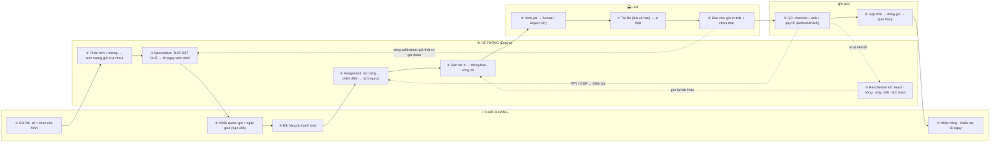

# Presentation Slides — PrintGrid (Bản ngắn — 7 slide)

> **Cách dùng:** Mỗi đoạn ngăn cách bởi `---` là **1 slide**. Copy vào PowerPoint/Canva, hoặc render bằng **Marp** (VS Code: extension `marp-team.marp-vs-code`) thành slides thật.
> **🎤 Lời nhắc** = script thuyết trình, để ở phần ghi chú, không đưa lên slide.
> **Thời lượng:** ~5–6 phút — mỗi slide 1 ý lớn, không quá 5 dòng.

---

## Slide 1 — Bìa

# ⬗ PrintGrid

### PrintGrid: Xây dựng nền tảng điều phối và tối ưu đơn hàng cho mạng lưới 3D Printing Lab phân tán
*Development of a Distributed 3D Printing Fulfillment and Scheduling Platform for a Network of Independent Printing Labs*

Capstone SE — FPT University · Nhóm 5 thành viên · GVHD: Nguyễn Tấn Phúc · **9/2026 – 3/2027**

🎤 Lời nhắc: Chào thầy/cô. Nhóm em làm PrintGrid — nền tảng đặt in 3D, nhưng giá trị cốt lõi nằm ở phần ĐIỀU PHỐI: biến các lab in nhỏ, độc lập thành một mạng lưới làm việc thông minh. Em trình bày 3 mục: Bối cảnh · Giải pháp · Công nghệ.

---

## Slide 2 — Context

# Vấn đề: mạng lưới in 3D đang "vỡ vụn"

- Năng lực in 3D nằm rải rác ở **nhiều lab nhỏ độc lập** (FabLab, maker space, xưởng nhỏ) — mỗi nơi một giá, một chuẩn, một hẹn trả
- **Khách** phải hỏi giá từng nơi, không ai so sánh được · **Lab** không thấy nhau: lab thì ngập việc, lab thì máy nằm im

**Bài toán thật:** gom vào một storefront — nhưng phải **cam kết giá + ngày giao TRƯỚC khi biết máy nào in**, rồi **giữ lời hứa đó trên máy mình không sở hữu**.

**Vì sao khó:** năng lực không chỉ là "bận/rảnh" (thiếu máy to, thiếu nhựa đúng màu là không nhận được) · ước lượng giờ in bị trôi theo máy · hỏng hóc là chuyện thường ngày → lời hứa ngày giao rất dễ vỡ

🎤 Lời nhắc: Nói 3 câu: (1) Ngành in 3D tiềm năng nhưng năng lực bị vỡ vụn thành các lab nhỏ riêng lẻ. (2) Khách đi hỏi cả chục nơi, lab thì không phối hợp được với nhau. (3) Giải pháp không phải làm web bán hàng — cái khó là phải HỨA ngày giao trước khi biết máy nào in, và chấp hành trên máy của người khác. → Đây là bài toán scheduling, không phải bài toán e-commerce. *Phần cuối giải thích thêm: khách chỉ thấy MỘT giá dù mỗi lab có chi phí khác nhau (§4.3) — giá và chi phí lab phải được tách bạch có chủ đích.*

---

## Slide 3 — Solutions

# Giải pháp: 1 bộ não điều phối + 3 cơ chế học

**⭐ Speculative Quote-Time Scheduling** — đưa đơn "thử đặt chỗ" lên lịch cả mạng lưới → ngày giao & giá đến từ năng lực THẬT (earliest feasible completion), không từ bảng hẹn; quote hạn 48h

**⭐ Capability-Filtered Assignment** — lọc cứng 6 điều kiện (công nghệ, kích thước, chính xác, vật tư, máy còn chạy, lab không bị kỷ luật) → chấm điểm 5 tiêu chí → tính lịch ngược từ ngày giao (có biên an toàn)
 
**⭐ Event-Driven Rescheduling** — lab từ chối, in hỏng, máy chết, QC trượt → tự lập lại lịch **trong ngân sách thời gian 30s**, luôn giữ giải pháp khả thi (dispatching rule) làm phương án lót; **không bao giờ đụng deadline đã hứa với khách**

**➕ Học theo thời gian** — so giờ in thật vs dự đoán (calibration) + chấm điểm lab bằng kết quả thật (performance ledger) → lời hứa lần sau chính xác hơn

**🎓 Gốc lý thuyết:** bài toán = *parallel machine scheduling* không tương đương — **NP-hard** → chọn lời giải khả thi tốt dưới time budget (EDD/ATC dispatching rule + simulated annealing / tabu search) thay vì tối ưu tuyệt đối

🎤 Lời nhắc: Kể 3 chữ theo bộ ba: CAM KẾT ĐÚNG (báo giá từ lịch thật — speculative), CHỌN ĐÚNG (lọc cứng → chấm điểm — capability-filtered), TỰ SỬA (rescheduling khi sự cố). Cuối: lý thuyết 1 câu cho hội đồng — bài toán thuộc lớp scheduling NP-hard, nên chúng em đúng tiêu chí khoa học khi chọn anytime algorithm: luôn có phương án khả thi, có thêm thời gian thì cải thiện.

---

## Slide 4 — Core flow (sơ đồ workflow)

# 10 bước — ai làm gì, cái gì quay vòng

🎤 Lời nhắc: Đọc theo 3 băng: băng giữa (Engine) là tim dự án — bước ③ và ⑤ là 2 ⭐. Hai mũi tên ĐỨT nét mới là đáng kể: mũi từ ⑧ vòng về ② (calibration — dự đoán chính xác hơn) và mũi từ ⑨ vòng về ⑤ (điểm lab nuôi lựa chọn). Mũi dọc từ ⑨ về ⑤ là reschedule. Nếu hội đồng hỏi "nút thắt ở đâu" → chỉ vào băng Engine.

*Mermaid render được ở: VS Code xem trước markdown (Ctrl+Shift+V), GitHub, hoặc dán vào [mermaid.live](https://mermaid.live) để xuất PNG/SVG dán vào PowerPoint.*

---

## Slide 5 — Tech

# Công nghệ: gọn, đủ, phù hợp đội 5 người

| Backend | Frontend | Dữ liệu & vận hành |
|---|---|---|
| .NET 8 · EF Core · MediatR (CQRS) | React + TypeScript · SignalR | PostgreSQL · Redis · MinIO · Hangfire · Docker |

**Kiến trúc: Modular Monolith + Clean Architecture** — 1 hệ triển khai, 6 module (Customer · Scheduling⭐ · Lab · Hub · Analytics · Admin), giao tiếp bằng **domain event**, chung 1 PostgreSQL với **schema-per-module**

- ✅ 1 cơ sở dữ liệu → đặt đơn + giữ máy trong cùng 1 transaction
- ✅ 1 deploy cho 5 người → 6 tháng khả thi · ranh giới module rõ → sẵn sàng tách microservice

🎤 Lời nhắc: Stack nêu nhanh một hơi. Nhấn 2 chữ "tại sao": PostgreSQL đơn vì phép gán máy phải đồng bộ với đơn hàng trong một giao dịch; Modular Monolith vì 5 người 6 tháng — không cần microservice, nhưng ranh giới module đã sẵn để tách sau.

---

## Slide 6 — Đánh giá / Bằng chứng

# Được đánh giá bằng dữ liệu, không bằng "demo đẹp"

**Simulation Harness** *(deliverable bắt buộc — WP5)* — mô phỏng **50+ lab, hàng trăm máy**, bơm lỗi theo cấu hình (rejection, print failure, inspection failure) → thuật toán được đo ở quy mô mạng lưới, không phải 3 máy 10 đơn

**So sánh với 2 baseline** trên cùng khối lượng tạo ra: gán **ngẫu nhiên** · gán **lab gần nhất** → đo **weighted tardiness**, tỷ lệ đúng hạn, mức sử dụng máy, độ đồng đều tải

**1 lab in thật** — so giờ dự đoán vs giờ thực → chứng minh vòng calibration; test giao diện shop-floor

**Tiêu chí thành công:** giữ lời hứa ngày giao > 95% · tận dụng năng lực > 70% · tỷ lệ lỗi < 5%

🎤 Lời nhắc: Nhấn: "Không team nào có 50 lab thật" — nên simulation là deliverable, dựng sớm (đã ghi trong phân việc WP5), để thuật toán thành con số đo được chứ không phải lời khẳng định. Metric chuẩn ngành: weighted tardiness + on-time rate. Cộng một lab thật để calibration có dữ liệu thật, vì lỗi ước lượng không mô phỏng ra được.

---

## Slide 7 — Cảm ơn & Q&A

# Xin cảm ơn! · *Questions?*

**Nhóm FA26SE249** · FPT University · 9/2026 – 3/2027

🎤 Lời nhắc — chuẩn bị sẵn 4 câu hay bị hỏi:
1. *Sao không microservice?* → Team 5 người, 6 tháng; scheduling cần transaction toàn cục; ranh giới module đã sẵn sàng tách.
2. *Máy in có kết nối thật không?* → Không. Phần IoT ngoài phạm vi; máy tham gia qua khai báo + thao tác thủ công của operator; có 1 lab thật để thu dữ liệu calibration.
3. *Lỡ lab khai năng lực khống?* → Performance đo bằng KẾT QUẢ THẬT (ODR/FPY), lab kém tự động bị giảm ưu tiên.
4. *Thuật toán có gì mới?* → Quote-time speculative scheduling + event-driven rescheduling ranh giới cứng "không đụng job đang in / không đụng deadline khách"; bài toán NP-hard nên dùng anytime algorithm (EDD/ATC + simulated annealing/tabu search), so sánh weighted tardiness với 2 baseline trong mô phỏng.

---

*Nguồn: documentation/01-Context · 04-Proposed-Solutions · 12-Use-Cases · 14-System-Architecture*