# Capstone Project Report
## Report 2 – Project Management Plan

**PrintGrid** — Distributed 3D Printing Fulfillment & Scheduling Platform
Hanoi, March 2027

---

## I. Record of Changes

| Date | A/M/D | In charge | Change Description |
|---|---|---|---|
| 02/09/2026 | A | Whole team | Initial creation of the Project Management Plan report |
| 15/03/2027 | M | Whole team | Final update after last Sprint Review; filled in actual results |
| | | | |

*A = Added · M = Modified · D = Deleted

---

## II. Project Management Plan

### 1. Overview

#### 1.1 Scope & Estimation

**PrintGrid** is a distributed 3D printing fulfillment platform: customers interact with a single unified system, while a network of independent printing labs fulfills the orders. The core academic contribution is the **scheduling & assignment engine** — quoting delivery dates derived from the network's actual capacity, instead of fixed lead-time tables.

| # | Week | WBS Item | Complexity | Est. Effort (man-days) |
|---|---|---|---|---|
| 1 | W1 | **Customer Module** | | **28** |
| 1.1 | W1 | Registration & authentication (FR-CUST-001) | Medium | 6 |
| 1.2 | W2 | 3D model upload & validation (FR-CUST-002, 004) | Complex | 8 |
| 1.3 | W1 | In-browser 3D model preview (FR-CUST-003) | Medium | 5 |
| 1.4 | W2 | Smart print configuration (FR-CUST-005) | Medium | 4 |
| 1.5 | W2 | Quoting + order placement + payment (FR-CUST-006→008) | Medium | 5 |
| 2 | | **Advanced Customer (Library, Tracking)** | | **11** |
| 2.1 | W2 | Personal model library (FR-CUST-010) | Simple | 3 |
| 2.2 | W4 | Real-time order tracking (FR-CUST-009) | Medium | 5 |
| 2.3 | W5 | Reprint / complaint requests (FR-CUST-011) | Simple | 3 |
| 3 | | **Lab Module** | | **22** |
| 3.1 | W3 | Lab registration & profile (FR-LAB-001) | Simple | 4 |
| 3.2 | W1 | Machine registry (FR-LAB-002) | Medium | 5 |
| 3.3 | W3 | Material inventory (FR-LAB-003) | Medium | 5 |
| 3.4 | W4 | Job accept/reject + production workflow (FR-LAB-004, 005) | Complex | 8 |
| 4 | | **Hub Module** | | **14** |
| 4.1 | W5 | Batch receipt & reconciliation (FR-HUB-001) | Medium | 3 |
| 4.2 | W4 | Quality inspection & defect classification (FR-HUB-002) | Complex | 6 |
| 4.3 | W5 | Reprint management & order consolidation (FR-HUB-003, 004) | Medium | 5 |
| 5 | | **Scheduling & Assignment (CORE)** | | **38** |
| 5.1 | W1 | Geometry analysis & slicing (FR-SCHED-001, 002) | Complex | 10 |
| 5.2 | W2 | Hard capability filtering (FR-SCHED-003) | Medium | 6 |
| 5.3 | W3 | Multi-criteria scoring (FR-SCHED-004) | Complex | 8 |
| 5.4 | W3 | Quote-time scheduling (FR-SCHED-005) | Complex | 8 |
| 5.5 | W4 | Job placement & event-driven rescheduling (FR-SCHED-006, 007) | Complex | 8 |
| 5.6 | W5 | Estimation calibration (FR-SCHED-008) | Medium | 6 |
| 6 | | **Analytics & Operations** | | **14** |
| 6.1 | W3 | Network monitoring dashboard (FR-ANALYTICS-001) | Medium | 4 |
| 6.2 | W4 | Lab performance tracking (FR-ANALYTICS-002) | Medium | 4 |
| 6.3 | W5 | SLA reporting (FR-ANALYTICS-003) | Simple | 3 |
| 6.4 | W3 | Manual intervention tools (FR-ANALYTICS-004) | Simple | 3 |
| 7 | | **Administration** | | **13** |
| 7.1 | W2 | User management & RBAC (FR-ADMIN-001) | Medium | 4 |
| 7.2 | W3 | Configuration management (FR-ADMIN-002) | Medium | 4 |
| 7.3 | W4 | Catalog management (FR-ADMIN-003) | Simple | 3 |
| 7.4 | W1 | Audit log viewer (FR-ADMIN-004) | Simple | 2 |
| 8 | | **Simulation, Evaluation & Real-lab Trial** | | **22** |
| 8.1 | W5 | Simulation framework + baseline comparison | Complex | 12 |
| 8.2 | W5 | Real-lab trial (calibration) | Medium | 10 |
| | | **Total Estimated Effort (man-days)** | | **≈ 162** |

*FR details from `documentation/09-Functional-Requirements.md`; complexity grading: Simple ≤ 4 man-days, Medium 5–6, Complex ≥ 8.*

**Summary per week (5-week plan, 5 team members):**

| Week | Focus / Milestone | Tasks | Est. Effort (man-days) | Main responsible |
|---|---|---|---|---|
| **W1** | Foundation & core pipeline | 1.1, 1.3, 5.1, 3.2, 7.4 | **28** | Backend + Algorithm + Frontend |
| **W2** | Customer core + capability filter | 1.2, 1.4, 1.5, 2.1, 5.2, 7.1 | **30** | Backend + Frontend |
| **W3** | Scheduling engine + Lab/Analytics | 5.3, 5.4, 3.1, 3.3, 6.1, 6.4, 7.2 | **36** | Algorithm + Backend |
| **W4** | Rescheduling + Lab/Hub workflows | 3.4, 4.2, 5.5, 2.2, 6.2, 7.3 | **34** | Full team |
| **W5** | Fulfillment, simulation & trial | 2.3, 4.1, 4.3, 5.6, 6.3, 8.1, 8.2 | **34** | QA + Algorithm + All |
| | **Total** | | **≈ 162** | |

> **Capacity note:** 5 people × 5 weeks = 125 man-days of nominal capacity, while the estimate is ≈ 162 man-days. This is achievable because tasks run **in parallel across work packages** (backend, frontend, algorithm, QA), with review/support effort counted inside each task and some overlap between weeks. If a strictly sequential team is assumed, the plan needs ≈ 6–7 weeks or a reduced scope.

#### 1.2 Project Objectives

Overall objective: build and evaluate a platform that demonstrates **capacity-aware intelligent scheduling** (speculative quote-time scheduling + event-driven rescheduling) for a distributed 3D printing lab network, together with a simulation framework comparing against baselines and one real-lab trial.

**Quantitative targets:**

| Metric | Target |
|---|---|
| On-time delivery rate | > 95% |
| Network capacity utilization | > 70% |
| Defect rate | < 5% |
| Fair work distribution | No single lab receives > 30% |
| Recovery after failure | Within one scheduling cycle |
| Scalability | 50+ labs, no architectural change |
| Quote response time | Preliminary < 5s, full < 60s (95th) |
| Rescheduling time | < 30s (average < 15s) |
| API response time | < 2s (95th), < 500ms (median) |
| Concurrent users | 100, without degradation |

**Quality:**

| # | Testing Stage | Test Coverage | No. of Defects | % of Defect | Notes |
|---|---|---|---|---|---|
| 1 | Reviewing (code review) | ≥ 80% of lines | ≤ 15 | ≤ 2% | Every PR reviewed |
| 2 | Unit Test | ≥ 70% (core domain ≥ 85%) | ≤ 25 | ≤ 5% | xUnit + FluentAssertions |
| 3 | Integration Test | ≥ 60% of API endpoints | ≤ 15 | ≤ 3% | WebApplicationFactory |
| 4 | System Test | 100% of MVP flows | ≤ 10 | ≤ 2% | Manual + scripted demo |
| 5 | Acceptance Test | Per `13-Acceptance-Criteria.md` | 0 critical | 0% | Verified with supervisor |

**Milestone Timeliness (%):** ≥ 90% — no more than 2 milestones delayed ≤ 1 week.

**Allocated Effort (man-days):**

| Activity | % | man-days |
|---|---|---|
| Analysis & design | 20% | ≈ 32 |
| Coding (backend + frontend + algorithm) | 45% | ≈ 73 |
| Testing & evaluation | 20% | ≈ 32 |
| Simulation & lab trial | 10% | ≈ 16 |
| Project management & documentation | 5% | ≈ 9 |
| **Total** | 100% | **≈ 162** |

#### 1.3 Project Risks

| # | Risk Description | Impact | Possibility | Response Plans |
|---|---|---|---|---|
| 1 | Slicing engine (CuraEngine/PrusaSlicer) incompatible or unavailable | High — affects scheduling input (core) | Medium | Test engine in week 1–2; keep a backup engine; mock slicing fallback if needed |
| 2 | No real partner lab available for the trial | High — missing calibration data | Medium | Secure a partner in week 1–2; otherwise use simulated history data |
| 3 | Print-time estimates drift → missed promised deadlines | High | Medium | Per-machine calibration (FR-SCHED-008); event-driven rescheduling |
| 4 | Scope creep (features outside requirements) | Medium | Medium | Feature freeze at week 14; weekly scope review; prioritize core scheduling |
| 5 | Team skills insufficient (.NET, React, Three.js, algorithms) | Medium | Medium | Training Plan; pair programming; supervisor guidance |
| 6 | Large model files slow down the system | Medium | Low | 50MB/file limit; async processing via Hangfire; MinIO |
| 7 | Scheduling algorithm too slow at large network sizes | Medium | Low | 30s time budget; heuristics + thresholds; early benchmarking |
| 8 | Model file leakage (customer IP) | High | Low | Time-limited downloads; access audit log; private MinIO buckets |

---

### 2. Management Approach

#### 2.1 Project Process (Software Development Process Model)

**Selected model: Scrum (Agile) with an up-front Analysis & Design phase and documentation milestones** — a hybrid that keeps the documentation discipline the capstone requires (reports, milestone reviews, partner-lab trial on a fixed date) while staying iteratively adaptable during implementation, because the scheduling requirements were too uncertain to lock fully in a Waterfall contract.

```mermaid
flowchart LR
    subgraph P0["Phase 0 — Analysis & Design (Weeks 1–4)"]
        A["Requirements<br/>44 FR · 43 NFR · 71 BR"]
        B["Design<br/>Architecture · ERD · API contract (OpenAPI)"]
        C["Sprint Backlog<br/>~280 story points, MVP-first"]
    end
    subgraph P1["Sprint Loop × 8 — Implementation (Weeks 4–20)"]
        D["Sprint Planning"]
        E["Development<br/>Code → Unit test → Review"]
        F["Sprint Review / Demo"]
        G["Retrospective"]
    end
    subgraph P2["Phase 2 — Validation & Delivery (Weeks 19–24)"]
        H["Simulation + real-lab trial"]
        I["Integration & regression"]
        J["Reports + Final demo"]
    end
    A --> B --> C --> D
    D --> E --> F --> G
    G --> D
    G --> H --> I --> J
```

**How it is applied:**

- **Phase 0 (Weeks 1–4):** finalize requirements, architecture, database schema and the **API contract before any frontend coding**, so backend/frontend work in parallel without contract mismatches. Output: this report, `documentation/` set, and the sprint backlog.
- **Sprint Loop × 8 (2-week sprints):** each sprint runs Planning → Development (code → unit test → review) → Demo with the supervisor → Retrospective. MVP first (weeks 1–12), extended scope (weeks 13–18), **feature freeze at week 14** (bug fixes and refinement only afterwards).
- **Daily cadence scaled down:** stand-up 3×/week (students, not blocking a full daily); a rotating facilitator takes the Scrum-Master role — no dedicated PO, the supervisor is the product owner proxy.
- **Work packages inside a sprint:** WP1 keeps the backlog and evaluation protocol, WP2 the scheduling engine, WP3 backend/pricing/geometry, WP4 customer & ops UI, WP5 lab/hub UI + **simulation harness built from the first sprint** (not as a testing afterthought), so the algorithm is measurable from week 5 onward.
- **Definition of Done** per story: code → unit test → code review → acceptance criteria met → demos cleanly.
- **Phase 2 (Weeks 19–24):** run the 50+ lab simulation and the partner-lab trial, regression, then finalize all reports, user guides and the final demo.

#### 2.2 Quality Management

- **Defect Prevention**: capture business rules (71 BR) during analysis; define OpenAPI spec before frontend coding to avoid contract mismatch.
- **Reviewing**: every PR reviewed by at least 1 reviewer; checklist (logic, style, tests).
- **Unit Testing**: test domain/scheduling logic first (highest risk); xUnit + NSubstitute.
- **Integration Testing**: WebApplicationFactory tests for main APIs.
- **System Testing**: full MVP demo flows; 50+ lab simulation scenarios.
- **Simulation validation**: compare algorithm vs 2 baselines (random, nearest-available).

#### 2.3 Training Plan

| Training Area | Participants | When, Duration | Waiver Criteria |
|---|---|---|---|
| .NET 8 + Clean Architecture (DDD) | Backend (Phuong, Thuy, Khanh) | Weeks 1–2, 4 sessions | Pass basic assessment |
| React + TypeScript + Three.js | Frontend (Huyen, Khanh) | Weeks 1–2, 4 sessions | Build a working sample component |
| Scheduling algorithms & simulation | Algorithm (Van, Phuong) | Weeks 1–3, 6 sessions | Run a mock scheduler |
| Git & GitLab workflow | Full team | Week 1, 2 sessions | Confident with PR + review |
| Docker / Docker Compose / CI | Backend + QA | Weeks 2–3, 2 sessions | Stand up the environment |
| PostgreSQL, Redis, SignalR, Hangfire | Backend + Frontend | Weeks 3–4, 3 sessions | Build a simple real-time flow |

---

### 3. Project Deliverables

| # | Deliverable | Due Date | Notes |
|---|---|---|---|
| 1 | Requirements docs (Context, FR, NFR, Scope...) | 30/09/2026 | Available in `documentation/` |
| 2 | Project Management Plan report (Report 2) | 30/09/2026 | This report |
| 3 | System architecture + ERD + API Design | 15/10/2026 | Docs `14–17 .md` |
| 4 | MVP: upload → quote → order → schedule flow | 30/11/2026 | Sprint Review demo |
| 5 | Lab + Hub flows (job handling, QC, reprint) | 15/12/2026 | |
| 6 | Simulation framework + baseline comparison | 15/01/2027 | Algorithm evaluation report |
| 7 | Extended scope (calibration, dashboards, model library) | 15/02/2027 | |
| 8 | Real-lab trial + results report | 28/02/2027 | If a partner lab is secured |
| 9 | User guide + Deployment guide + Final demo | 10/03/2027 | |

---

### 4. Responsibility Assignments

**Legend:** D = Do · R = Review · S = Support · I = Informed

> **Note:** The role assignments below are the **suggested default mapping based on the 5 Work Packages in the project README** — replace with each member's actual role and keep the table.

| Responsibility | KhanhNTHE03579 | VanNTTHE04680 | PhuongDTHE03246 | HuyenDTHE04671 | ThuyVT04278 |
|---|---|---|---|---|---|
| Project Planning & Tracking | D | S | S | R | S |
| Prepare Project Introduction / Context | D | R | S | S | R |
| Requirements analysis & Business Rules | R | D | S | S | R |
| Architecture & DB design (ERD) | R | R | D | S | S |
| API contract (OpenAPI) | I | R | D | R | I |
| Scheduling & Assignment algorithm | S | **D** | R | I | R |
| Simulation & baseline evaluation | R | **D** | S | I | R |
| Backend development | I | R | **D** | I | S |
| Frontend development (React/Three.js) | I | I | S | **D** | S |
| Testing (unit/integration/system) | R | R | S | S | **D** |
| Real-lab trial & calibration | S | **D** | R | I | R |
| Documentation & Final demo | D | R | R | R | R |

---

### 5. Project Communications

| Communication Item | Who / Target | Purpose | When, Frequency | Type, Tool, Method(s) |
|---|---|---|---|---|
| Sprint Planning | Full team | Define sprint scope | Start of each sprint (2 weeks) | Meeting · Google Meet / class |
| Daily Standup | Full team | Progress update, unblock issues | 3×/week, 15 min | Video call · Microsoft Teams |
| Sprint Review / Demo | Team + Supervisor | Demo results, gather feedback | End of sprint | Meeting · live demo |
| Monthly progress report | Team → Supervisor | Scope review, early warnings | Monthly | Report + discussion |
| Technical discussions | Dev team | Resolve technical issues | Continuous | Chat · Teams/Zalo |
| With partner lab | Team ↔ Lab | Trial preparation & data collection | Weeks 18–20 | Email / Meeting |
| Task & defect tracking | Full team | Track work and bugs | Continuous | GitLab Issues · ProjectLibre |

---

### 6. Configuration Management

#### 6.1 Document Management

- Project documents are managed in the Git repository (folder `documentation/`) — the authoritative copy, versioned by commit history.
- Working drafts/concepts use Google Drive (Docs/Sheets/Slides) before being finalized into the repo.
- Rules: never edit released documents directly; changes → update Record of Changes + create a new commit.
- Consistent file naming: `NN-DocumentName.md` (01-Context, 05-Main-Features...).

#### 6.2 Source Code Management

- **Git** with remote on **GitLab**.
- `main` branch is protected; development on **feature branches** named `feature/<module>-<name>`, fixes as `fix/<description>`.
- Workflow: create branch → small meaningful commits → **Merge Request** → ≥1 reviewer → merge to `main`.
- **Version tags** (`v0.1.0`, `v1.0.0-mvp`...) at milestones; link issues/defects to related commits.
- Backup: push regularly to GitLab; never work directly on `main`.

#### 6.3 Tools & Infrastructures

| Category | Tools / Infrastructure |
|---|---|
| Technology | **React 18 + TypeScript** (Frontend) · **Three.js** (3D preview) · **.NET 8 / C#** (Backend, Modular Monolith + Clean Architecture) |
| Database | **PostgreSQL** (primary) · **Redis** (cache/session) |
| Storage | **MinIO** (3D model files, photos; S3-compatible) |
| Background jobs / Realtime | **Hangfire** (background jobs) · **SignalR** (real-time) |
| IDEs/Editors | Visual Studio 2022, Visual Studio Code |
| Diagramming | Draw.io, StarUML, Excalidraw |
| Documentation | Markdown (repo), Microsoft Office, Google Docs/Sheets |
| Version Control | **Git + GitLab** (source) · Git (finalized documents) |
| Deployment | Docker + Docker Compose, Nginx (reverse proxy), AWS (staging) |
| Project management | GitLab Issues (tasks, defects) · **ProjectLibre** (high-level schedule) |
| Testing | xUnit, NSubstitute, FluentAssertions, Swagger/OpenAPI |

---

*Report prepared by the PrintGrid team · Capstone SEP490 · Supervisor: Nguyễn Tấn Phúc · Sep 2026 – Mar 2027*